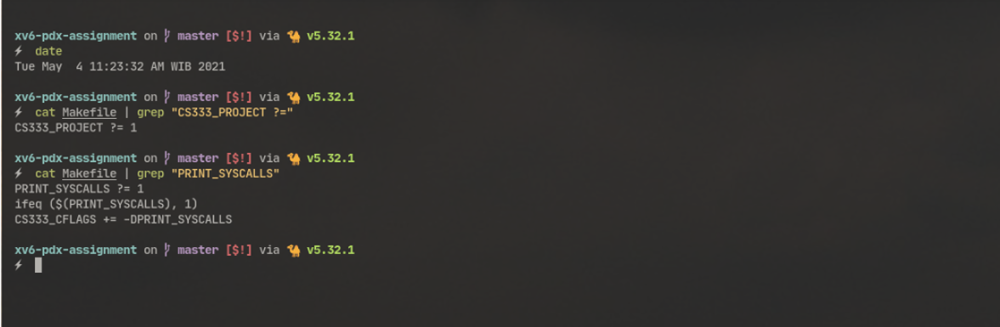
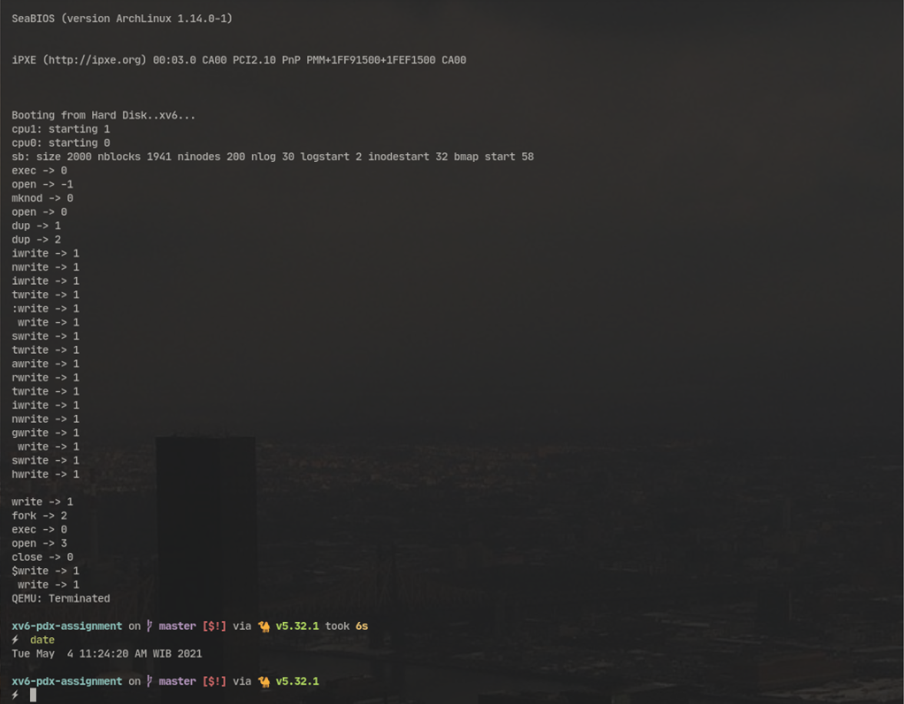
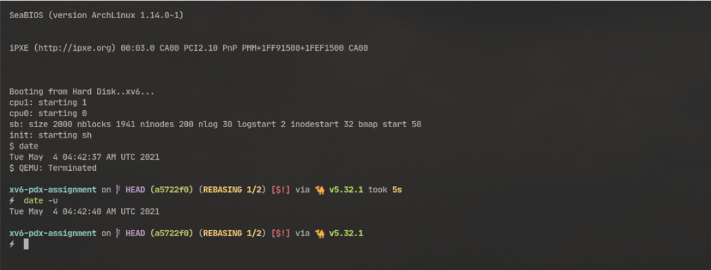
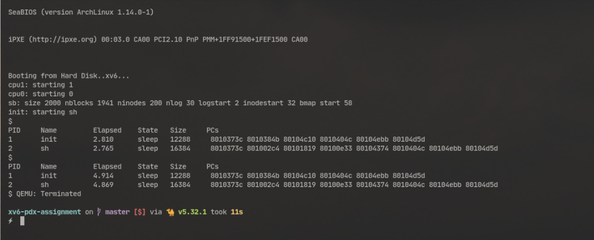

# Syscall Tracing

## Image



## syscall.c
```diff
diff --git a/syscall.c b/syscall.c
index 9105b52..b2f5249 100644
--- a/syscall.c
+++ b/syscall.c
@@ -172,6 +172,9 @@ syscall(void)
   num = curproc->tf->eax;
   if(num > 0 && num < NELEM(syscalls) && syscalls[num]) {
     curproc->tf->eax = syscalls[num]();
+    #ifdef CS333_P1
+    cprintf("%s -> %d\n", syscallnames[num],num);
+    #endif
   } else {
     cprintf("%d %s: unknown sys call %d\n",
             curproc->pid, curproc->name, num);

```

# DATE syscall

## Image


## Makefile
```diff
diff --git a/Makefile b/Makefile
index 6483959..acba3d9 100644
--- a/Makefile
+++ b/Makefile
@@ -1,6 +1,6 @@
 # Set flag to correct CS333 project number: 1, 2, ...
 # 0 == original xv6-pdx distribution functionality
-CS333_PROJECT ?= 0
+CS333_PROJECT ?= 1
 PRINT_SYSCALLS ?= 0
 CS333_CFLAGS ?= -DPDX_XV6
 ifeq ($(CS333_CFLAGS), -DPDX_XV6)
@@ -13,7 +13,7 @@ endif
 
 ifeq ($(CS333_PROJECT), 1)
 CS333_CFLAGS += -DCS333_P1
-CS333_UPROGS += #_date
+CS333_UPROGS += _date
 endif
 
 ifeq ($(CS333_PROJECT), 2)

```

## date.c
```diff
diff --git a/date.c b/date.c
index cff33a2..4f920ea 100644
--- a/date.c
+++ b/date.c
@@ -38,9 +38,9 @@ main(int argc, char *argv[])
   r.hour %= 12;
   if (r.hour == 0) r.hour = 12;
 
-  printf(1, "%s %s%d %s %d %s%d:%s%d:%s%d %s UTC\n", days[day], PAD(r.day), r.day,
-      months[r.month], r.year, PAD(r.hour), r.hour, PAD(r.minute), r.minute,
-      PAD(r.second), r.second, s);
+  printf(1, "%s %s  %d %s%d:%s%d:%s%d %s UTC %d\n", days[day], months[r.month], 
+      r.day, PAD(r.hour), r.hour, PAD(r.minute), r.minute,
+      PAD(r.second), r.second, s, r.year);
 
   exit();
 }

```

## syscall.c
```diff
diff --git a/syscall.c b/syscall.c
index b2f5249..1072be7 100644
--- a/syscall.c
+++ b/syscall.c
@@ -106,6 +106,9 @@ extern int sys_uptime(void);
 #ifdef PDX_XV6
 extern int sys_halt(void);
 #endif // PDX_XV6
+#ifdef CS333_P1
+extern int sys_date(void);
+#endif
 
 static int (*syscalls[])(void) = {
 [SYS_fork]    sys_fork,
@@ -132,6 +135,9 @@ static int (*syscalls[])(void) = {
 #ifdef PDX_XV6
 [SYS_halt]    sys_halt,
 #endif // PDX_XV6
+#ifdef CS333_P1
+[SYS_date]    sys_date,
+#endif
 };
 
 #ifdef PRINT_SYSCALLS
@@ -160,6 +166,9 @@ static char *syscallnames[] = {
 #ifdef PDX_XV6
   [SYS_halt]    "halt",
 #endif // PDX_XV6
+#ifdef CS333_P1
+  [SYS_date]    "date",
+#endif
 };
 #endif // PRINT_SYSCALLS
 
@@ -172,8 +181,9 @@ syscall(void)
   num = curproc->tf->eax;
   if(num > 0 && num < NELEM(syscalls) && syscalls[num]) {
     curproc->tf->eax = syscalls[num]();
-    #ifdef CS333_P1
-    cprintf("%s -> %d\n", syscallnames[num],num);
+    #ifdef PRINT_SYSCALLS
+    int retval = curproc->tf->eax;
+    cprintf("%s -> %d\n", syscallnames[num],retval);
     #endif
   } else {
     cprintf("%d %s: unknown sys call %d\n",
```

## syscall.h
```diff
diff --git a/syscall.h b/syscall.h
index 7fc8ce1..14f3e17 100644
--- a/syscall.h
+++ b/syscall.h
@@ -22,3 +22,4 @@
 #define SYS_close   SYS_mkdir+1
 #define SYS_halt    SYS_close+1
 // student system calls begin here. Follow the existing pattern.
+#define SYS_date    SYS_halt+1
```

## sysproc.c
```diff
diff --git a/sysproc.c b/sysproc.c
index 98563ea..c5435df 100644
--- a/sysproc.c
+++ b/sysproc.c
@@ -97,3 +97,17 @@ sys_halt(void)
   return 0;
 }
 #endif // PDX_XV6
+
+#ifdef CS333_P1
+int
+sys_date(void)
+{
+  struct rtcdate *d;
+
+  if(argptr(0, (void*)&d, sizeof(struct rtcdate)) < 0)
+    return -1;
+
+  cmostime(d);
+  return 0;
+}
+#endif
```

## user.h
```diff
diff --git a/user.h b/user.h
index 31d9134..f236eff 100644
--- a/user.h
+++ b/user.h
@@ -25,6 +25,9 @@ char* sbrk(int);
 int sleep(int);
 int uptime(void);
 int halt(void);
+#ifdef CS333_P1
+int date (struct rtcdate*);
+#endif // CS333_P1
 
 // ulib.c
 int stat(char*, struct stat*);
```

## usys.S
```diff
diff --git a/usys.S b/usys.S
index 0d4eaed..84bd80b 100644
--- a/usys.S
+++ b/usys.S
@@ -30,3 +30,4 @@ SYSCALL(sbrk)
 SYSCALL(sleep)
 SYSCALL(uptime)
 SYSCALL(halt)
+SYSCALL(date)
```

# Ctrl-P

## Image


## proc.c
```diff
diff --git a/proc.c b/proc.c
index d030537..4aade9e 100644
--- a/proc.c
+++ b/proc.c
@@ -149,6 +149,10 @@ allocproc(void)
   memset(p->context, 0, sizeof *p->context);
   p->context->eip = (uint)forkret;
 
+  // Initialize start_ticks variable with 
+  // ticks global variable
+  p->start_ticks = ticks;
+
   return p;
 }
 
@@ -563,7 +567,14 @@ procdumpP2P3P4(struct proc *p, char *state_string)
 void
 procdumpP1(struct proc *p, char *state_string)
 {
-  cprintf("TODO for Project 1, delete this line and implement procdumpP1() in proc.c to print a row\n");
+  int cur_ticks = ticks - (p->start_ticks);
+  if (cur_ticks < 1000)
+    cprintf("%d\t%s\t     0.%d\t%s\t%d\t ", p->pid, p->name,cur_ticks, states[p->state], p->sz);
+  else{
+    int rem = cur_ticks % 1000;
+    cur_ticks = cur_ticks / 1000;
+    cprintf("%d\t%s\t     %d.%d\t%s\t%d\t ", p->pid, p->name, cur_ticks, rem, states[p->state], p->sz);
+  }
   return;
 }
 #endif
```

## proc.h
```diff
diff --git a/proc.h b/proc.h
index 0a0b4c5..c6f8522 100644
--- a/proc.h
+++ b/proc.h
@@ -49,6 +49,7 @@ struct proc {
   struct file *ofile[NOFILE];  // Open files
   struct inode *cwd;           // Current directory
   char name[16];               // Process name (debugging)
+  uint start_ticks;            // Store initial time when allocated
 };
 
 // Process memory is laid out contiguously, low addresses first:
```
